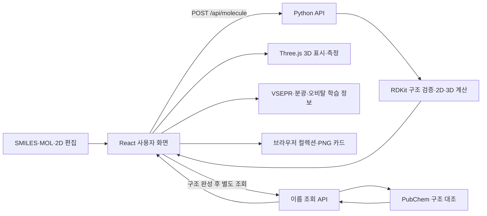

# 모두의 화학 스튜디오

**분자 구조를 직접 만들고 2D와 3D로 살펴보는 화학 학습 도구**

[웹에서 바로 사용하기](https://molecule-studio-ee6n.vercel.app/)

## 사용 목적

모두의 화학 스튜디오는 작은 분자의 구조와 성질을 한 화면에서 탐구할 수 있는 한국어 웹 앱입니다. 예시 분자를 고르거나 SMILES·MOL 형식을 입력하고, 2D 편집기에서 원자와 결합을 직접 구성할 수 있습니다. 완성한 구조는 3D 모형으로 돌려 보고 원자 사이의 거리와 각도를 측정할 수 있습니다.

구조 분석 결과에는 다음 내용이 포함됩니다.

- 분자식, 분자량, 수소 결합 주개·받개 등 기본 정보
- 일반명과 IUPAC 이름(확인 가능한 경우)
- 2D 구조식과 회전·확대 가능한 3D 분자 모형
- 선택한 원자 사이의 거리와 각도
- 중심 원자 주변의 VSEPR 기하 설명
- IR, <sup>1</sup>H NMR, <sup>13</sup>C NMR, UV-Vis 학습용 참고 범위
- 선택 원자의 혼성 오비탈 개념도
- 학습 노트, 분자 컬렉션 저장, PNG 학습 카드 내보내기

## 사용 방법

1. **분자를 준비합니다.** 첫 화면의 예시를 선택하거나 SMILES를 입력하고, MOL 파일을 가져올 수 있습니다. 2D 편집기에서는 원소를 선택한 뒤 빈 공간을 눌러 원자를 배치합니다. 원자를 연결하려면 `결합 도구`와 결합 차수를 선택한 뒤 두 원자를 차례로 누릅니다.
2. **3D 구조를 만듭니다.** `3D 만들기` 또는 SMILES 분석 버튼을 누릅니다. 2D 구조에서 생략한 수소는 분석 과정에서 자동으로 보완됩니다.
3. **구조를 관찰합니다.** 3D 화면을 드래그해 회전하고 휠이나 트랙패드로 확대·축소합니다. 원소 기호와 수소 표시도 켜고 끌 수 있습니다.
4. **거리와 각도를 측정합니다.** 거리 측정은 원자 2개, 각도 측정은 원자 3개를 순서대로 선택합니다. 각도에서는 두 번째 원자가 꼭짓점입니다. 화면에서 선택하기 어렵다면 원자 목록을 사용할 수 있습니다.
5. **설명과 분광 참고 자료를 읽습니다.** 원자 보기에서 중심 원자를 고르면 VSEPR 설명을 확인할 수 있습니다. 오비탈 표시를 켜면 선택 원자의 혼성 오비탈 개념도가 나타납니다. 기본 물성, 작용기와 분광 범위도 함께 비교할 수 있습니다.
6. **학습 기록을 남깁니다.** 측정한 뒤 `기록`을 눌러 측정값을 남기고, 노트를 작성해 분자를 컬렉션에 저장합니다. 현재 내용은 PNG 학습 카드로 내려받을 수도 있습니다.

분석 뒤 2D 구조나 SMILES를 바꾸면 기존 3D 결과는 이전 구조의 결과가 됩니다. 안내에 따라 다시 분석한 뒤 저장하거나 내보내세요.

### 로컬에서 실행하기 (선택)

아래 명령은 Windows PowerShell 기준입니다. Node.js 22.12 이상과 Python 3.13이 필요하며, RDKit은 `requirements.txt` 설치 항목에 포함되어 있습니다.

```powershell
npm ci
python -m venv .venv
.\.venv\Scripts\python.exe -m pip install -r requirements.txt
```

첫 번째 터미널에서 API를 실행합니다.

```powershell
.\.venv\Scripts\python.exe -X utf8 api\molecule.py
```

두 번째 터미널에서 웹 앱을 실행합니다.

```powershell
npm run dev
```

브라우저에서 `http://127.0.0.1:5173`을 엽니다. 개발 서버는 `/api` 요청을 `http://127.0.0.1:8001`의 Python API로 전달합니다.

## 작동 구조



프런트엔드는 구조 입력과 학습 상태를 관리하고, Python API는 RDKit으로 입력을 검증한 뒤 2D 이미지와 3D 좌표, 분자 정보와 교육용 설명 데이터를 반환합니다. 분자식의 원자 수는 아래첨자, 전하는 위첨자로 읽기 쉽게 표시합니다. 3D 좌표는 ETKDGv3로 생성하고, 가능한 경우 MMFF94 또는 UFF로 최소화합니다. 3D 결과가 먼저 준비되며 이름은 별도로 조회됩니다. 이름 조회가 늦거나 실패해도 구조 관찰과 측정은 계속 사용할 수 있습니다.

### 주요 코드 경로

| 경로 | 역할 |
| --- | --- |
| `src/App.tsx` | 입력, 분석 요청, 이름 조회, 노트·컬렉션, PNG 내보내기 흐름 |
| `src/components/Sketcher.tsx` | 원자와 결합을 구성하는 2D 편집기 |
| `src/components/MoleculeViewer.tsx` | Three.js 기반 3D 표시와 거리·각도 측정 |
| `src/components/Spectra.tsx` | 분광 학습 자료 표시 |
| `api/molecule.py` | 분자 분석과 이름 조회를 제공하는 HTTP API |
| `chemistry/model.py` | RDKit 기반 구조 검증, 2D 묘사, 3D 좌표와 기본 물성 계산 |
| `chemistry/naming.py` | PubChem 이름 조회와 구조 일치 확인 |
| `chemistry/vsepr.py`, `chemistry/spectra.py` | VSEPR 및 분광 참고 자료 생성 |

### 저장과 개인정보

컬렉션에 저장한 분자 구조·노트·측정값은 현재 브라우저의 로컬 저장소에 보관됩니다. 계정이나 서버 동기화 기능은 없으므로 브라우저 데이터 삭제 또는 다른 기기로 이동할 때 자동으로 옮겨지지 않습니다. 분석 입력은 계산을 위해 서버로 전송되며, 이름을 조회할 때는 SMILES가 PubChem으로 전달됩니다. 공유하거나 보관할 결과는 PNG 학습 카드로 내려받을 수 있습니다.

### 과학적 범위

이 앱은 교육용 탐구 도구입니다. 3D 좌표는 RDKit이 생성한 하나의 계산 구조이며 실험 구조, 전역 최저 에너지 구조 또는 양자화학 계산 결과를 뜻하지 않습니다. 거리와 각도도 이 계산 좌표를 기준으로 합니다. VSEPR 설명은 지원하는 중심 원자 환경에 한정되고, 오비탈 그림은 개념 모형입니다. 분광 정보는 넓은 참고 범위이므로 실제 피크 위치·세기·적분값을 예측하지 않습니다. IUPAC 이름은 PubChem 결과가 현재 구조와 일치할 때만 표시됩니다.

자세한 화면 사용법은 [사용 안내](docs/USER_GUIDE.md), 계산 방법과 지원 범위는 [과학적 범위](docs/SCIENCE.md)에서 확인할 수 있습니다.
