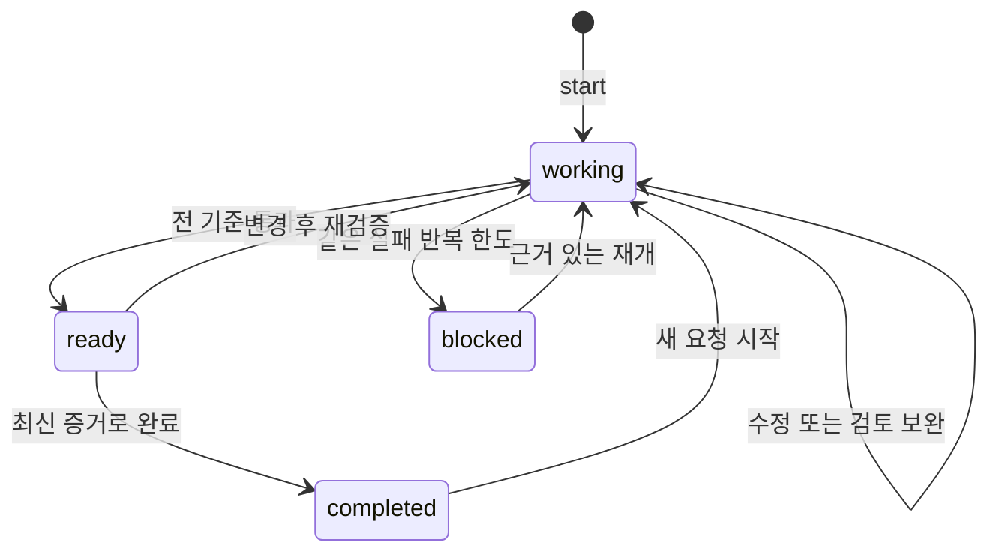

# 재구축 근거와 구조

## 확인한 공식 권고

AI타임스가 소개한 자료는 Eric Provencher의 2026년 9월 11일 OpenAI 글입니다. 공식 글은 짧고 정확한 스킬 설명, 필요한 상세만 읽는 구성, 작업에 맞는 문서 참조를 권고합니다. 또한 아스트라에 안전한 작업의 권한과 끝까지 수행할 완료 범위를 명확히 알려주고, 불필요한 반복 검사를 유발하는 지침을 재검토하도록 설명합니다. [OpenAI 원문](https://developers.openai.com/blog/rethinking-skills-and-prompts-for-gpt-6-astra)

사용자가 제공한 기사의 본문과 위 연결 원문을 모두 확인했습니다. [AI타임스 기사](https://www.aitimes.com/news/articleView.html?idxno=215202)

## 이번 프로젝트의 설계 선택

ai가 자의적으로 판단하여 결정한 대답:

다음 구조·버전명·기본 한도는 공식 글의 취지를 UAISE에 적용한 설계입니다. OpenAI가 제공한 공식 UAISE 구조나 성능 인증이 아닙니다.

| v3.1.1 | v4.0.0 Astra |
|---|---|
| AGENTS·SYSTEM의 반복 행동 규칙 | AGENTS 한 곳의 짧은 행동 지침 |
| 모든 작업 전 여러 문서 확인 | 목적·완료 기준과 지금 필요한 입력만 확인 |
| Planner→Builder→Tester→Reviewer→Critic→Checkpoint | 역할 순서를 고정하지 않는 실제 작업과 검증 상태 |
| 모든 운영 완료에 최소 20개 사례 | 작업의 전 완료 조건 충족; 사례 수는 필요에 맞춤 |
| 종료에서 검사를 다시 실행 | 현재 소스·증거에 맞는 PASS는 완료 시 재사용 |
| 코딩 중심 Eval 스키마 | 명령 검사와 내용 검토를 함께 지원 |
| 별도 GitHub Skills판 | 하나의 기본 구조, 필요한 호스트 기능만 연결 |
| 시작 당시 집계와 완료 집계 | 현재 실행 기록과 증거 최신성을 함께 확인 |

INTENT는 무엇을 해결하는지, 계약은 무엇을 확인하면 끝나는지를 담당합니다. SPEC과 PLAN은 복잡한 요구·의존성에 필요할 때만 생성합니다. 단순 오타 수정도 명령 검사를 무조건 만들 필요 없이 파일과 실제 내용 검토로 완료를 표현할 수 있습니다.

하네스는 작업 권한과 완료 증거를, 그래프는 실제 상태 전환을, 루프는 실패 후 수정·재검증을 담당합니다. 단계마다 별도 에이전트를 강제하지 않습니다.

완료 증거는 검사 명령 출력, 검토 기록, 해당 시점 파일의 해시를 포함합니다. status는 명령을 재실행하지 않습니다. 명시적으로 verify를 호출하면 새 검사를 수행합니다. 원격 서비스나 환경처럼 파일 밖에서 바뀌는 조건은 별도 입력 스냅샷 또는 명시적 재검증으로 다룹니다.

일괄 스킬 설치 대신 references/ROUTER.md에서 작업 유형에 맞는 자료를 선택하게 했습니다. 이를 통해 기본 행동 지침이 분야별 매뉴얼로 커지지 않게 구성했습니다. 실제 스킬이 필요한 프로젝트에서는 설명이 좁고 적용 조건이 분명한 것만 호스트에 연결합니다.

기본 실패 반복 한도 2회와 총 검사 시간 600초는 운영을 위한 초기 설정입니다. 실측으로 도출한 최적값이 아니며 프로젝트 계약에서 조정합니다. 모델의 전체 토큰·실행 시간은 호스트가 관리합니다.

>‐---------------------------<

## 실제로 측정한 정적 분량

| 비교 범위 | v3.1.1 | v4.0.0 |
|---|---:|---:|
| AGENTS.md 문자 수 | 1,085 | 644 |
| 초기 확인 문서의 문자 수 | 4,332 | 1,174 |
| 같은 문서의 UTF-8 바이트 | 7,356 | 2,205 |

v3.1.1은 AGENTS·SYSTEM·INTENT·SPEC·PLAN·현재 상태 파일, v4.0.0은 AGENTS·INTENT·contract를 합산했습니다. 줄바꿈과 공백을 포함한 빈 배포 템플릿의 문자 수입니다. 실제 입력 토큰이나 비용 측정이 아니며, 작업 내용을 채우면 크기는 달라집니다. 이전판의 숫자와 새 숫자 모두 실제 파일에서 계산했습니다.

## 다음 실사용 비교

실제 오르카에서 같은 Astra 설정·과제·입력·도구·완료 조건을 유지하고 v3.1.1과 v4.0.0을 비교합니다. 목적이 다른 계약을 쓰면 지침 구조의 효과와 요구 수준 차이가 섞일 수 있습니다. 따라서 비교시험에서는 완료 기준과 평가자가 확인할 항목을 사전에 동일하게 맞춥니다.

설치·주요 기능의 결함 수, 실제 사용자가 수행한 조작의 성공 여부, 결과의 근거 정확도, 경과 시간과 호스트가 제공하는 사용량을 기록합니다. 프레임워크 단위검사 수를 서로 비교해 제품 품질 점수로 바꾸지 않습니다. 합성 예제 검증은 실제 분자 앱의 정확도·교육 효과를 증명하지 않습니다.
